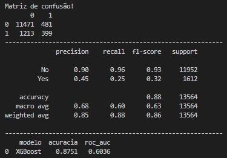

### Projeto - Campanha de Marketing do Banco

Base de dados utilizada foi retirada do site: https://archive.ics.uci.edu/ml/datasets/bank+marketing

Neste projeto realizamos uma análise de uma base de dados pública referente a uma campanha de marketing de um banco português ocorrida entre maio de 2008 e novembro de 2010. Nosso objetivo final é treinar um modelo de Machine Learning que possa prever se um cliente, em uma campanha futura, irá ser convertido pela campanha ou não. Temos, portanto, duas classes: cliente convertido e não convertido. Primeiro foi realizada uma limpeza dos dados, acompanhada de uma formtação para levar os dados a serem analisados no Power BI. Neste último foi feito um dashboard com as principais métricas para acompanhamento, uma primeira análise descritiva dos dados. Posteriormente voltamos ao python onde realizamos uma análise estatística no Jupyter Notebook. Por fim, iniciou-se a preparação para a etapa de previsão com um pré-processamento dos dados. Com essa etapa finalizada, treinamos o modelo com quatro algoritmos: KNN Classifier, Random Forest Classifier, CatBoost Classifier e XGBoost Classifier. Após a aplicação de um GridSearchCV nesses quatro algoritmos, optamos por estimar o modelo com o XGBoost por ter a maior acurácia e valor ROC-AUC, junto ao algoritmo CatBoost, porém com um tempo de treinamento muito menor (50 segundos x 8 minutos). Os resultados podem ser vistos abaixo:

  

